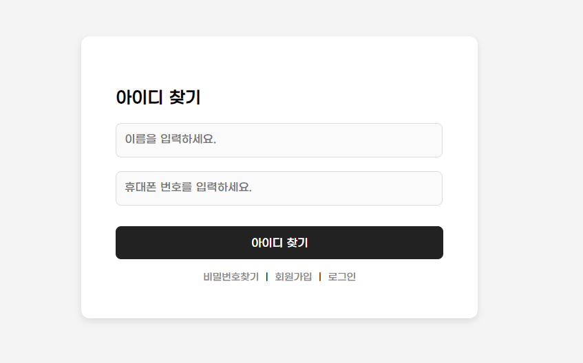

# JSP_Project
## JSP project 3조

---

## 프로젝트 소개
### 패션 쇼핑몰 웹 사이트
- 목적: 패션 관련 상품정보를 확인하고 구매할 수 있는 웹 플랫폼
- 개발환경 : Eclipse, Oracle SQL Developer, Apache Tomcat
- 프로젝트 기간 : 2024/09.09 ~ 10.11
- 레퍼런스 사이트 : 무신사 (www.musinsa.com)
- 작업 페이지 : 메인페이지, 회원가입, 로그인, 카테고리, 장바구니, 마이페이지, 결제

---

## 역할 분담
| 이름         | 역할 및 담당 페이지               |
|--------------|-----------------------------------|
| **조장 김민성** | 마이페이지(Front-end, Back-end) / DB 설계 및 제작 / Jsoup 크롤링 / 메인페이지(F, B) / Git 세팅 / PPT 발표              |
| **부조장 박정호**      | 카테고리(F, B) / 로그인(B) / 회원가입(B) / 장바구니(F, B) / 마이페이지(B) / Jsoup 크롤링 / PPT 발표               |
| **팀원 김창범**      | 결제(F, B) / 로그인 (F, B) / 마이페이지(F) / PPT 검토 수정          |
| **팀원 김후리**      | 로그인(F) / 회원가입(F) / 마이페이지(B) / PPT 제작                      |
| **팀원 손홍석**      | 메인페이지(F) / 와이어프레임 제작                        |
| **팀원 조유영**      | 장바구니(F) / 버그리포트 정리                         |

---

## 구현내용
| 메인페이지         | 
|:--------------:|
|          | 
|       | 
|       | 

| 회원가입 및 로그인         | 
|:--------------:|
|          | 
|          | 

| 아이디 및 비밀번호 찾기         | 
|:--------------:|
|          | 
|          | 
|          | 

| 마이페이지         | 
|:--------------:|
|          | 
|          | 
|          | 
|          | 

| 카테고리 및 상세페이지         | 
|:--------------:|
|          | 
|          | 
|          | 

| 장바구니         | 
|:--------------:|
|          | 

| 결제         | 
|:--------------:|
|          | 
|          | 

---

## 발표자료 링크
- [PPT](https://docs.google.com/presentation/d/1IGEmHusgiLpn3clZe5-6HE_ZGcPviR37/edit?usp=sharing&ouid=103958824280178808603&rtpof=true&sd=true)
- [발표 대본](https://docs.google.com/document/d/19Gw2rSmGd10lAWRf2lrgyFRLPusIcHUMQusU9WExq74/edit?usp=sharing)
- [버그 리포트](https://docs.google.com/spreadsheets/d/1Wd2aEn0XFTGkbarRR41pWAqGu5akTeFQTQ0lZvBtZZQ/edit?usp=sharing)

